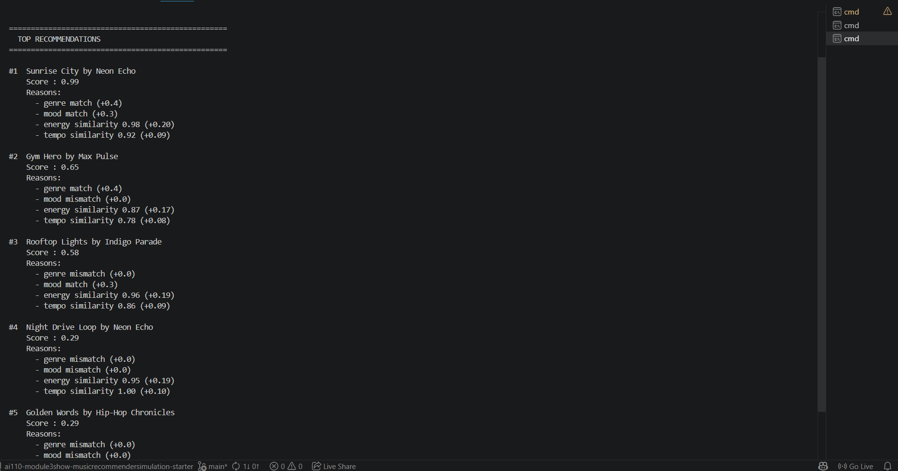

# 🎵 MoodConstructor

## Project Summary

A hybrid AI music recommender system that combines semantic similarity, dynamic LLM-generated weights, and weighted scoring.

**Key Features:**
- JSON-based knowledge base of 50 songs with vibe descriptions
- Semantic similarity for genre/mood matching (via sentence-transformers embeddings)
- Dynamic weight generation using OpenAI's API (with fallback to defaults)
- Hybrid scoring engine combining math-based metrics + AI-driven weights
- Top-K ranking for final recommendations
- Streamlit web UI for interactive recommendations

**Architecture:**
1. **Knowledge Base** — Songs stored in JSON with text descriptions
2. **Semantic Matching** — Genre/mood similarity via embeddings (not strict matching)
3. **Dynamic Weighting** — LLM agent generates weights based on user mood + song vibe
4. **Scoring** — Weighted sum of semantic + numeric similarities
5. **Ranking** — Top-K songs sorted by final score

---

## How The System Works

### Features
- **Song**: id, title, artist, genre, mood, energy (0-1), tempo_bpm, valence, danceability, acousticness, **vibe_description**
- **UserProfile**: favorite_genre, favorite_mood, target_energy, likes_acoustic

### Scoring Formula
```
score = W_genre × genre_sim + W_mood × mood_sim + W_energy × energy_sim + W_tempo × tempo_sim
```

Where:
- `genre_sim` and `mood_sim` are computed via cosine similarity of text embeddings (0-1)
- `energy_sim` = 1 - |song_energy - user_energy|
- `tempo_sim` = 1 - |norm_song_tempo - norm_user_tempo|
- **W_genre, W_mood, W_energy, W_tempo** are dynamically generated by OpenAI (fallback: 0.4, 0.3, 0.2, 0.1)

### Improvements Over v1
- **Near-miss fix**: "pop" and "indie-pop" now score ~0.8 instead of 0
- **Adaptive weights**: Weights adjust per song based on user context
- **Richer descriptions**: Vibe descriptions enable LLM reasoning

## Getting Started

### Prerequisites

- Python 3.8+
- OpenAI API key (optional, but required for dynamic weights)

### Setup

1. **Clone/copy the project** and navigate to the directory:
   ```bash
   cd applied-ai-system-project
   ```

2. **Create a virtual environment** (optional but recommended):
   ```bash
   python -m venv .venv
   .venv\Scripts\activate         # Windows
   source .venv/bin/activate      # Mac or Linux
   ```

3. **Install dependencies:**
   ```bash
   pip install -r requirements.txt
   ```

4. **(Optional) Set up OpenAI API key** for dynamic weight generation:

   **Option A: Environment variable (persistent)**
   - On Windows: Open System → Advanced system settings → Environment Variables
   - Add new user variable:
     - Name: `OPENAI_API_KEY`
     - Value: `sk-your-key-from-openai-dashboard`
   - Restart terminal/IDE
   
   **Option B: Command line (session only)**
   ```bash
   set OPENAI_API_KEY=sk-your-key-here    # Windows
   export OPENAI_API_KEY=sk-your-key-here # Mac/Linux
   ```

   **Option C: .env file** (create `.env` in project root)
   ```
   OPENAI_API_KEY=sk-your-key-here
   ```
   Then run (requires `python-dotenv`):
   ```bash
   python -c "from dotenv import load_dotenv; load_dotenv()"
   ```

5. **Verify the setup:**
   ```bash
   python -c "import os; print(f'OpenAI API key set: {bool(os.getenv(\"OPENAI_API_KEY\"))}')"
   ```

6. **Run the recommender:**

   **Web UI (recommended):**
   ```bash
   python -m streamlit run src/app.py
   ```

   **CLI (terminal menu):**
   ```bash
   python src/main.py
   ```

### Getting an OpenAI API Key

1. Go to [https://platform.openai.com/api/keys](https://platform.openai.com/api/keys)
2. Sign in with your OpenAI account (or create one)
3. Click **"Create new secret key"**
4. Copy and save the key
5. Set it in your environment (see Step 4 above)

**Note:** If the API key is not set, the system automatically falls back to default weights (0.4, 0.3, 0.2, 0.1) without errors.

### Running Tests

Run the starter tests with:

```bash
pytest
```

You can add more tests in `tests/test_recommender.py`.

---

## Sample Output



### Profile Results

**High-Energy Pop**


**Chill Lofi**


**Deep Intense Rock**


**Conflicting: Lofi + High Energy (Edge Case)**


**Unknown Genre — Classical (Edge Case)**


---

## Experiments You Tried

Use this section to document the experiments you ran. For example:

- What happened when you changed the weight on genre from 2.0 to 0.5
- What happened when you added tempo or valence to the score
- How did your system behave for different types of users

---

## Limitations and Risks

Summarize some limitations of your recommender.

Examples:

- It only works on a 50-song catalog
- It does not understand lyrics or language
- It might over favor one genre or mood

You will go deeper on this in your model card.

---

## Reflection

Read and complete `model_card.md`:

[**Model Card**](model_card.md)

### Profile Comparisons

- **High-Energy Pop vs. Chill Lofi** — They are completely opposite top results. Pop profile surfaces fast happy songs, while lofi profile surfaces slow chill beats. Both score near-perfect (0.98–0.99) because all three key features aligned, confirming the scoring works as intended to the system.

- **High-Energy Pop vs. Deep Intense Rock** — Both want high energy, but the genre splits the rankings. Pop gets Sunrise City; Rock gets Storm Runner. Gym Hero appears in both top 3s because strong energy similarity bridges the genre gap when mood overlaps.

- **Deep Intense Rock vs. Conflicting: Lofi + High Energy** — Rock profile scores 0.99; the conflicting profile peaks at 0.52. The genre weight forces lofi songs to the top even though none match the requested high energy, which expose the filter bubble problem directly.

- **Chill Lofi vs. Unknown Genre (Classical)** — Lofi gets near-perfect matches because the genre is well-represented. Classical is a bit weird: one real genre match, then falls back on mood alone, showing the system loses signal when a genre is rare.

- **Conflicting: Lofi + High Energy vs. Unknown Genre (Classical)** — Both edge cases fail for different reasons: one has self-contradicting preferences, the other has an underrepresented genre. Neither user gets a truly satisfying recommendation.


---

## 7. `model_card_template.md`

Combines reflection and model card framing from the Module 3 guidance. :contentReference[oaicite:2]{index=2}  

```markdown
# 🎧 Model Card - Music Recommender Simulation

## 1. Model Name

Give your recommender a name, for example:

> VibeFinder 1.0

---

## 2. Intended Use

- What is this system trying to do
- Who is it for

Example:

> This model suggests 3 to 5 songs from a small catalog based on a user's preferred genre, mood, and energy level. It is for classroom exploration only, not for real users.

---

## 3. How It Works (Short Explanation)

Describe your scoring logic in plain language.

- What features of each song does it consider
- What information about the user does it use
- How does it turn those into a number

Try to avoid code in this section, treat it like an explanation to a non programmer.

---

## 4. Data

Describe your dataset.

- How many songs are in `data/songs.csv`
- Did you add or remove any songs
- What kinds of genres or moods are represented
- Whose taste does this data mostly reflect

---

## 5. Strengths

Where does your recommender work well

You can think about:
- Situations where the top results "felt right"
- Particular user profiles it served well
- Simplicity or transparency benefits

---

## 6. Limitations and Bias

Where does your recommender struggle

Some prompts:
- Does it ignore some genres or moods
- Does it treat all users as if they have the same taste shape
- Is it biased toward high energy or one genre by default
- How could this be unfair if used in a real product

---

## 7. Evaluation

How did you check your system

Examples:
- You tried multiple user profiles and wrote down whether the results matched your expectations
- You compared your simulation to what a real app like Spotify or YouTube tends to recommend
- You wrote tests for your scoring logic

You do not need a numeric metric, but if you used one, explain what it measures.

---

## 8. Future Work

If you had more time, how would you improve this recommender

Examples:

- Add support for multiple users and "group vibe" recommendations
- Balance diversity of songs instead of always picking the closest match
- Use more features, like tempo ranges or lyric themes

---

## 9. Personal Reflection

A few sentences about what you learned:

- What surprised you about how your system behaved
- How did building this change how you think about real music recommenders
- Where do you think human judgment still matters, even if the model seems "smart"

