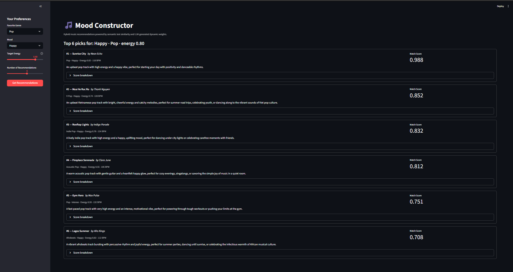
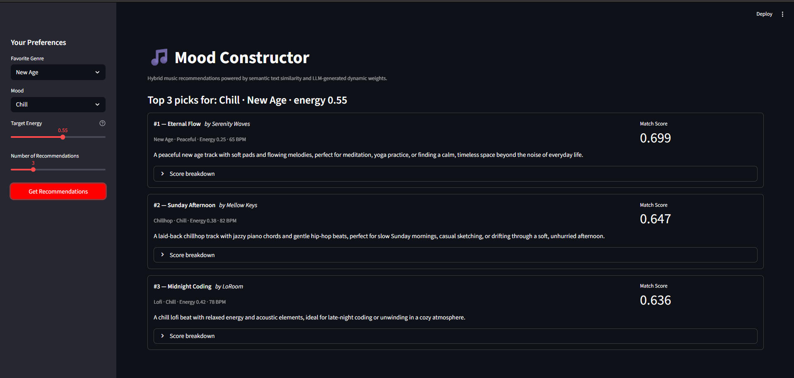
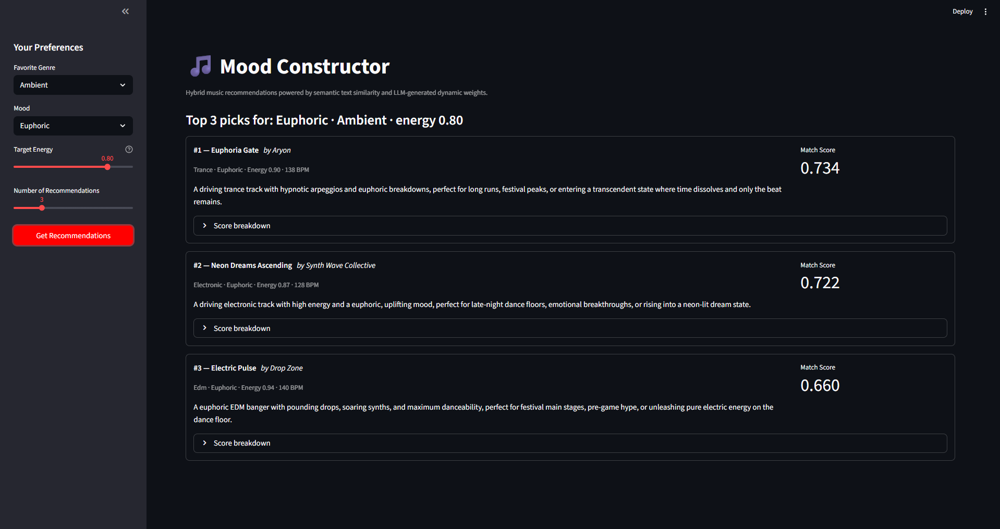
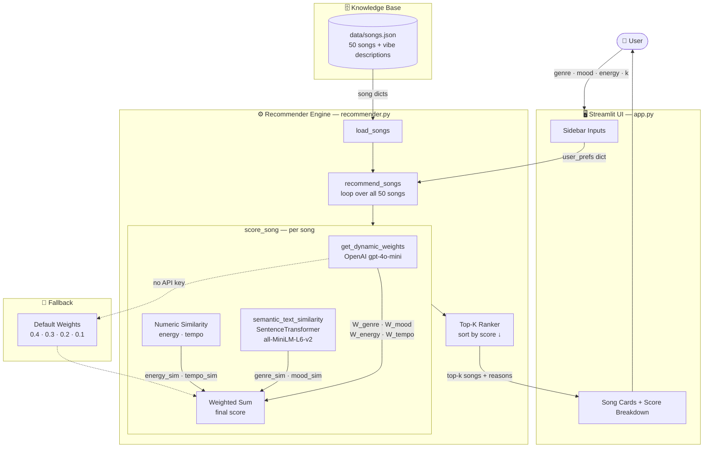

# Original Project: 
> VibeFinder 1.0
- This was the original project from module 3, with its purpose being able to suggests 3 to 5 songs from a small catalog based on a user's preferred genre, mood, and energy level. This was still considered a prototype due to many limits that it shows in order to recommend a song.

# New Improvement: 
> Introduce: 🎵 MoodConstructor

## Project Summary

A hybrid AI music recommender system that combines semantic similarity, dynamic LLM-generated weights, and weighted scoring.

**Key Features:**
- JSON-based knowledge base of 50 songs with vibe descriptions
- Semantic similarity for genre/mood matching (via sentence-transformers embeddings)
- Dynamic weight generation using OpenAI's API (with fallback to defaults)
- Hybrid scoring engine combining math-based metrics + AI-driven weights
- Top-K ranking for final recommendations
- Streamlit web UI for interactive recommendations

**Architecture:**
1. **Knowledge Base** — Songs stored in JSON with text descriptions
2. **Semantic Matching** — Genre/mood similarity via embeddings (not strict matching)
3. **Dynamic Weighting** — LLM agent generates weights based on user mood + song vibe
4. **Scoring** — Weighted sum of semantic + numeric similarities
5. **Ranking** — Top-K songs sorted by final score

---

## How The System Works

### Features
- **Song**: id, title, artist, genre, mood, energy (0-1), tempo_bpm, valence, danceability, acousticness, **vibe_description**
- **UserProfile**: favorite_genre, favorite_mood, target_energy, likes_acoustic

### Scoring Formula
```
score = W_genre × genre_sim + W_mood × mood_sim + W_energy × energy_sim + W_tempo × tempo_sim
```

Where:
- `genre_sim` and `mood_sim` are computed via cosine similarity of text embeddings (0-1)
- `energy_sim` = 1 - |song_energy - user_energy|
- `tempo_sim` = 1 - |norm_song_tempo - norm_user_tempo|
- **W_genre, W_mood, W_energy, W_tempo** are dynamically generated by OpenAI (fallback: 0.4, 0.3, 0.2, 0.1)

### Improvements Over v1
- **Near-miss fix**: "pop" and "indie-pop" now score ~0.8 instead of 0
- **Adaptive weights**: Weights adjust per song based on user context
- **Richer descriptions**: Vibe descriptions enable LLM reasoning

---

## Design Decisions

### Why Not Static Weights?

The v1 formula used hardcoded weights — genre always 40%, mood always 30%, energy always 20%, tempo always 10% — regardless of what song was being scored or what the user actually wanted. Testing revealed this was too rigid: a calm lofi song and a festival anthem were being judged by the exact same formula, even though "genre" matters a lot more for some songs and "energy" matters a lot more for others. The weights felt arbitrary and produced a filter bubble — the system always surfaced the same genre the user already liked, never helping them discover anything new.

The decision to replace static weights with **LLM-generated dynamic weights** came from wanting the scoring to feel contextually aware. By feeding the user's mood and the song's vibe description to GPT-4o-mini and asking it to decide which features should matter most for *this specific pairing*, the weights now shift per song. A meditation track gets a heavier energy weight; a dance anthem gets a heavier genre weight. The trade-off is cost and latency — every recommendation round calls the API once per song — but the fallback to default weights (0.4 / 0.3 / 0.2 / 0.1) ensures the app still works without a key.

### Why Semantic Similarity for Genre and Mood?

In v1, genre matching was binary — either the song's genre exactly matched the user's input, or it scored zero. This meant a user who wanted "pop" got nothing from an "indie pop" song, even though those two genres are musically adjacent. A user who wanted "chill" got zero from a "relaxed" song, even though those moods describe nearly the same feeling. The system was punishing songs for not using the exact same label, which felt wrong.

The fix was to stop treating genre and mood as categories and start treating them as **text with meaning**. By encoding both the user's preference and the song's genre/mood into sentence embeddings (via `all-MiniLM-L6-v2`) and computing cosine similarity, "pop" vs "indie pop" now scores ~0.8, "chill" vs "relaxed" scores ~0.9, and truly unrelated pairs like "metal" vs "ambient" score near 0. Songs earn partial credit for being close, not just full credit or nothing. The trade-off is that the model must load on startup, adding a few seconds on first run.

### Where Did RAG Come In?

Even with dynamic weights and semantic similarity, there was still a problem: the LLM had no context about what a song actually *sounds like* when deciding how to weight it. Asking GPT-4o-mini to weigh a song it knows nothing about would just produce generic answers.

The solution was to give each song a **vibe description** — a short natural language summary of its sound, energy, and feel (e.g., *"A chill lofi beat with relaxed energy and acoustic elements, ideal for late-night coding..."*). These descriptions act as a retrieved knowledge base: when scoring a song, the system retrieves that song's description and passes it directly into the LLM prompt alongside the user's mood. This is the RAG pattern — retrieve relevant context, then generate. The LLM can now reason about a specific song's character when deciding weights, rather than guessing blindly. The trade-off is that the descriptions were written by hand, so they reflect the catalog curator's interpretation of each song rather than objective musical analysis.

---

## Getting Started

### Prerequisites

- Python 3.8+
- OpenAI API key (optional, but required for dynamic weights)

### Setup

1. **Clone/copy the project** and navigate to the directory:
   ```bash
   cd applied-ai-system-project
   ```

2. **Create a virtual environment** (optional but recommended):
   ```bash
   python -m venv .venv
   .venv\Scripts\activate         # Windows
   source .venv/bin/activate      # Mac or Linux
   ```

3. **Install dependencies:**
   ```bash
   pip install -r requirements.txt
   ```

4. **(Optional) Set up OpenAI API key** for dynamic weight generation:

   **Option A: Environment variable (persistent)**
   - On Windows: Open System → Advanced system settings → Environment Variables
   - Add new user variable:
     - Name: `OPENAI_API_KEY`
     - Value: `sk-your-key-from-openai-dashboard`
   - Restart terminal/IDE
   
   **Option B: Command line (session only)**
   ```bash
   set OPENAI_API_KEY=sk-your-key-here    # Windows
   export OPENAI_API_KEY=sk-your-key-here # Mac/Linux
   ```

   **Option C: .env file** (create `.env` in project root)
   ```
   OPENAI_API_KEY=sk-your-key-here
   ```
   Then run (requires `python-dotenv`):
   ```bash
   python -c "from dotenv import load_dotenv; load_dotenv()"
   ```

5. **Verify the setup:**
   ```bash
   python -c "import os; print(f'OpenAI API key set: {bool(os.getenv(\"OPENAI_API_KEY\"))}')"
   ```

6. **Run the recommender:**

   **Web UI (recommended):**
   ```bash
   python -m streamlit run src/app.py
   ```

   **CLI (terminal menu):**
   ```bash
   python src/main.py
   ```

### Getting an OpenAI API Key

1. Go to [https://platform.openai.com/api/keys](https://platform.openai.com/api/keys)
2. Sign in with your OpenAI account (or create one)
3. Click **"Create new secret key"**
4. Copy and save the key
5. Set it in your environment (see Step 4 above)

**Note:** If the API key is not set, the system automatically falls back to default weights (0.4, 0.3, 0.2, 0.1) without errors.

### Running Tests

Run the starter tests with:

```bash
pytest
```

You can add more tests in `tests/test_recommender.py`.

---

## Testing Summary

### Unit Tests — What Passed

Two unit tests in `tests/test_recommender.py` were run with `pytest` and both passed:

- **`test_recommend_returns_songs_sorted_by_score`** — Given a pop/happy/high-energy user profile and a two-song catalog (one pop, one lofi), the recommender correctly ranked the pop song first. This confirmed the scoring logic and the `Recommender.recommend()` method produce rankings in the right direction.
- **`test_explain_recommendation_returns_non_empty_string`** — Confirmed that `explain_recommendation()` returns a non-empty string, verifying that score breakdowns are always generated and never silently empty.

### Interactive Tests — What Was Explored

`interactive_test.py` was used to explore three aspects of the system manually:

**1. Semantic Similarity (Option 1)**
This was the clearest success. Running genre and mood pairs against the catalog showed that the sentence-transformer model handled near-matches correctly — "pop" vs "indie pop" scored around 0.8, "chill" vs "relaxed" scored high, and unrelated pairs like "metal" vs "ambient" scored near 0. This directly fixed the binary matching failure from v1.

**2. Dynamic Weight Agent (Option 2)**
This is where a key limitation surfaced. The OpenAI API key was not available during testing, so every call to `get_dynamic_weights()` silently fell back to the hardcoded defaults (genre=0.4, mood=0.3, energy=0.2, tempo=0.1). The interactive test confirmed this by printing `⚠ No API key found. Using default weights.` — meaning the LLM-generated weighting feature was never actually exercised. All weights during testing were static, making the "dynamic" part of the system untested in practice.

**3. End-to-End Recommendations (Option 3)**
Despite running on fallback weights, the recommendations still felt noticeably better than v1 — mostly because semantic similarity alone was doing a lot of work. Profiles like Pop/Happy and Lofi/Chill returned very strong top scores (0.98+), while niche genre profiles like New Age and Ambient returned lower scores (0.69–0.73), which honestly reflects that those genres have fewer catalog matches. Cross-genre edge cases like Ambient + Euphoric surfaced Trance and Electronic results instead of Ambient — the mood and energy similarity pulled in adjacent genres even when the genre label didn't match.

### What Was Learned

The biggest takeaway was that **semantic similarity alone accounts for most of the quality improvement** over v1. The system worked well in testing even without a live LLM call, which suggests the design has a solid baseline. The dynamic weights, however, remain a hypothesis — the system was designed to adapt per song, but that behavior was never verified against an actual API response. If the LLM weights were tested, the expectation is that scores for niche-genre profiles (New Age, Ambient) would shift upward as the LLM deprioritizes genre weight in favor of mood and energy for those pairings.

---

## Sample Interactions

### Pop · Happy · Energy 0.80
Top result: **Sunrise City** by Neon Echo — Match Score **0.988**. The system surfaces pop and pop-adjacent tracks with happy moods and high energy, with the Vietnamese pop track "Mua He Ruc Ro" appearing at #2 thanks to semantic genre similarity.



---

### New Age · Chill · Energy 0.55
Top result: **Eternal Flow** by Serenity Waves — Match Score **0.699**. With a niche genre like New Age, the system falls back on mood and energy similarity, pulling in adjacent calm genres (Chillhop, Lofi) when exact genre matches are scarce.



---

### Ambient · Euphoric · Energy 0.80
Top result: **Euphoria Gate** by Aryon — Match Score **0.734**. A cross-genre edge case: the mood (Euphoric) and energy (0.80) pull in Trance and Electronic despite the Ambient genre input, showing how dynamic LLM weights can shift priority toward mood when genre conflicts with energy.



---

## Architecture Overview



---

## Reflection

### AI Does Not Have to Be Complex to Be Better

The most surprising thing this project taught me was that the biggest quality improvement came from the simplest AI component. Swapping binary genre matching for sentence-transformer embeddings — a change that took about ten lines of code — made "pop" and "indie pop" feel related instead of completely alien to each other. That single change did more for recommendation quality than any amount of weight tuning. It made me realize that in AI systems, the representation of the problem often matters more than the sophistication of the model on top of it. The v1 system was failing not because the math was wrong, but because it was doing math on the wrong thing — treating genre labels as arbitrary IDs rather than words with meaning.

### The Gap Between Designed and Tested Is Real

Building this project also made me understand something uncomfortable about AI development: a feature can be fully designed, correctly implemented, and never actually work in production — and the system will still run as if everything is fine. The LLM dynamic weight feature is a good example. The code is there, the prompt is there, the fallback is there, and the app shows no errors. But because the API key wasn't available during testing, every single recommendation was made with the same static fallback weights (0.4 / 0.3 / 0.2 / 0.1). The "AI" in the system was completely bypassed, and from the outside, nobody could tell. That is a real lesson about how AI systems can hide their own failures behind graceful degradation — which is good for reliability, but dangerous if you mistake "no errors" for "working correctly."

### Weights Encode Assumptions, Not Truth

Working through the weight experiments from v1 into v2 made it clear that whoever sets the weights in a recommender is encoding their own assumptions about what music is. Saying genre is worth 40% is not a neutral technical decision — it is a statement that "you should mostly listen to what you already know." Lowering that weight to 20% and raising energy to 40% says something completely different: "how a song feels matters more than what genre it belongs to." Real apps like Spotify are making these same calls at massive scale, and those decisions shape what billions of people discover. Building even a small version of this made that feel less abstract and more like a genuine responsibility.

### Problem-Solving: Start From What Feels Wrong

The whole process of this project — from v1 to MoodConstructor — started from two specific things that felt wrong: weights that never changed, and a genre system that punished songs for having slightly different labels. That frustration turned into two concrete solutions (LLM weighting, semantic embeddings), and those solutions then pulled in a third idea (RAG for vibe descriptions) as a necessary supporting piece. That chain — frustration → diagnosis → solution → supporting idea — is the clearest example of problem-solving I have gone through in this course. The lesson I take from it is that the best starting point for building something is not "what cool technology can I use" but "what specifically feels broken and why."

---
